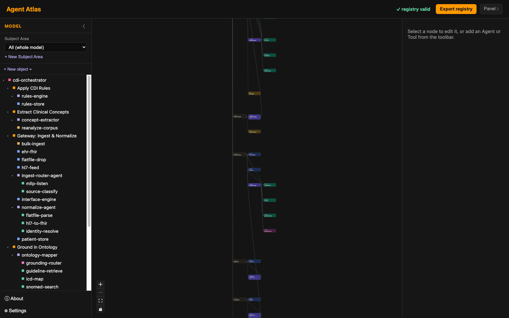

# agent-atlas-studio

**Model your agentic AI platform like the system it actually is — then generate it, and (soon) prove the running system matches.**

`agent-atlas-studio` is an Erwin‑style visual modeler for agentic AI systems. You lay out the whole platform — the orchestrator, its tasks, the agents, their MCP tools, jobs, model routers, and the datastores they touch — as **one collapsible model**. Every object is validated live against the open [`agent-atlas`](https://github.com/Fox-River-AI/agent-atlas) manifest schema, and the model exports to a version‑controlled registry that becomes the source of truth for building and governing the fleet.



<p align="center"><sub>A governed clinical‑CDI platform: one orchestrator → tasks → agents → tools / jobs / systems, validated and ready to export.</sub></p>

[](LICENSE)


---

## Why

The demo is magic; six months later the system is a rat's nest — nobody can say how many agents are running, what each one does, which tools they share, or whether any of it still matches the design. An agent fleet is a distributed system, and like microservices it needs a **registry, typed contracts, and a way to see the whole estate**. `agent-atlas-studio` is that registry, made visual: it doesn't make a complex platform simple — it makes it **legible, validated, and governable** as it grows.

## What it does

- **Model the whole platform.** Seven first‑class object types in one hierarchical, collapsible graph:
  - **Orchestrator** — the single control plane (which task/agent runs, in what order, on what condition).
  - **Task** — a stage of the workflow (groups the agents that carry it out).
  - **Agent** — single‑responsibility worker, pinned model, refusal as a first‑class output, declared telemetry.
  - **MCP Tool** — the typed, audited call boundary (effect class: read / write / external).
  - **Job** — long‑running / async work (queue, timeout, retries).
  - **Router** — dynamic model selection (candidate models + a routing policy by complexity / quality / cost).
  - **System** — the datastores and external systems agents touch (databases, vector stores, graph/ontology stores, FHIR endpoints, interface engines).
- **Navigate at scale.** Double‑click to expand/collapse any node; **Subject Areas** are saved views that focus the whole platform down to one slice. Dark / light / high‑contrast themes, scalable type.
- **Validate live.** Every object is checked against the `agent-atlas` JSON schema as you edit. Invalid objects are flagged in the tree, and a plain‑language issue list names exactly what's missing and jumps you to it.
- **Export a registry.** Produce the versioned manifests (`*.orchestrator.yaml`, `*.agent.yaml`, `*.tool.yaml`, `*.job.yaml`, `*.router.yaml`, `*.system.yaml`) — the single source of truth for the fleet.

## How it relates to agent-atlas

[`agent-atlas`](https://github.com/Fox-River-AI/agent-atlas) is the open engine: the manifest **schema** (the source of truth) and the deterministic **validators**. This repo vendors it as a git submodule and imports the schema directly — there is exactly one copy, so the modeler can never drift from the spec.

```
agent-atlas (engine: schema + validators)  ──submodule──▶  agent-atlas-studio (this: the visual modeler)
```

## Run it

```bash
git clone --recurse-submodules https://github.com/Fox-River-AI/agent-atlas-studio.git
cd agent-atlas-studio
npm install

npm run dev          # web build  → http://localhost:5173
npm run tauri dev    # desktop app (local-first: write registries to disk)
```

*(Cloned without `--recurse-submodules`? Run `git submodule update --init`.)*

Built on **Vite + React 19**, packaged as a **Tauri 2** desktop app, with **no cloud dependency** — it runs identically as a static web build and as a local desktop application.

## Roadmap

The studio is the visual front of an Erwin‑style loop — **design ⇄ build ⇄ verify**:

| Phase | What it does | Status |
|---|---|---|
| **Model** | Lay out the platform; validate live; export the registry. | ✅ working |
| **Build handoff** | Generate the bundle a coding agent (e.g. Claude Code) needs to build the modeled system: registry + a `CLAUDE.md` contract + `PreToolUse` enforcement hooks. | 🔜 next |
| **Reverse + conformance** | Recover the *running* system's agent/tool graph from OpenTelemetry traces and diff it against the declared registry — show where reality has drifted from the design. | 📋 planned |

The model is the spec, `CLAUDE.md` is the contract, the hooks are the enforcement, and conformance proves the model is *true* — not just drawn.

## License

[Apache-2.0](LICENSE) © Fox River AI
